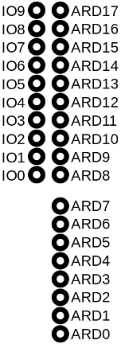
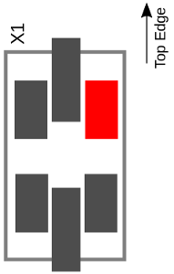

# gbaHD
A GBA to DVI converter.

To create a stable HDMI signal without buffering whole frames, but rather
go line-by-line, the quartz crystal of the GBA is removed. Instead, 
the FPGA generates the clock signal for the GBA.

## Wiring
You need some basic soldering skills to wire all signals of the GBA to the
FPGA board and the controller to the Arduino. All responsibility is on
you. **I do not take any responsibility for any potential damages.** The 
following wiring works well for me. **Yet again, all risk is up to you.
If you want a more out-of-the-box experience, I strongly suggest you to
do not tinker around with your devices.** This is a simply hobby project of 
mine without a lot of testing.

In general, the test points of the GBA motherboard are not made for a
lot of soldering, so try to keep your soldering quick.

### SEA pins
The following figure shows an overview of the pins used for signals on
the Spartan Edge Accelerator board and the pin names used.

### Video signals
The following figure shows the test points for the display signals on
the GBA motherboard. I only used a 40 pin model so far, but the 32 pin
should have a similar layout. The test points can be found on the
frontside of the GBA motherboard close to the top.

The connections between the GBA display signals and the FPGA board are 
as follows (check the previous figures for the pin names):

| GBA Display Pin | FPGA Pin | GBA LCD Pin |
|-----------------|----------|----------|
| 2               | IO0   | 26 |
| 5               | IO1   | 23 |
| 6               | ARD5  | 22 |
| 7               | IO2   | 21 |
| 8               | ARD6  | 20 |
| 9               | IO3   | 19 |
| 10              | ARD7  | 17 |
| 11              | IO4   | 16 |
| 12              | ARD8  | 15 |
| 13              | IO5   | 14 |
| 14              | ARD9  | 13 |
| 15              | IO6   | 12 |
| 16              | ARD10 | 11 |
| 17              | IO7   | 10 |
| 18              | ARD11 | 9 |
| 19              | ARD13 | 8 |
| 22              | IO9   | 3 |

### Audio signals
The GBA generates a stereo 8 bit audio signals as a PWM which is then
amplified. We pick up both PWM signals using the following two
connections (the test point names can be found on the silkscreen of the
GBA motherboard).

| GBA Test Point  | FPGA Pin |
|-----------------|----------|
| S01             | ARD2 |
| S02             | ARD3 |

### Clock signal
The clock crystal has to be removed and a pad of the former crystal is 
connected to an FPGA pin. The following figure shows which pad has to be 
connected (the highlighted one) to the FPGA pin.

| GBA | FPGA Pin |
|-----|----------|
| XTAL pad  | IO8 |

### Controller signals
A cheap Arduino (e.g., a small Nano) handles the controller input (the 
FPGA board is not used here, as we would run out of pins here). The
following figure shows the pinout of a SNES controller plug.

The SNES controller port is connected to the Arduino pins as follows:

| SNES controller | Arduino Pin |
|-----------------|-------------|
| 5V              | 5V |
| Clk             | A1 |
| Latch           | A0 |
| Data            | A2 |
| Gnd             | Gnd |

The following table shows the connections between the GBA motherboard
and Arduino pins for simulating the button presses.

|  GBA Test Point  | Arduino Pin |
|------------------|-------------|
| TP6              | D2 |
| TP7              | D3 |
| TP5              | D4 |
| TP4              | D5 |
| TP0              | D6 |
| TP1              | D7 |
| TP9              | D8 |
| TP8              | D9 |
| TP3              | D10 |
| TP2              | D11 |

### Power connections
The GBA and Arduino can be powered via pins of the FPGA board. For the
GBA, the battery holders on the motherboard can be desoldered, as they are
not required anymore. Then connect the "B+" pad of the GBA motherboard to
the "3V3" pin of the SEA board and the GBA's "B-" pad to a GND pin of the
SEA board. Keep the power switch of the GBA on the ON position
(preferably fix it in this position, as the switch is quite smooth-running).

The Arduino requires 5V instead of 3.3V. For this, put the jumper 
"PWR_MODE" to the "ON" position. Then connect the 5V pin of the SEA
board's Arduino ICSP pins to the 5V pin of the Arduino.

## TODOs

*README TODO:*
- Add the rest of the wiring.
- Describe the overall project.
- Describe the different modules.
- Describe pinouts.
- Describe GBA video timing.

*General TODO:*
- Cleanup
- Design PCB shield
- 1080p output
